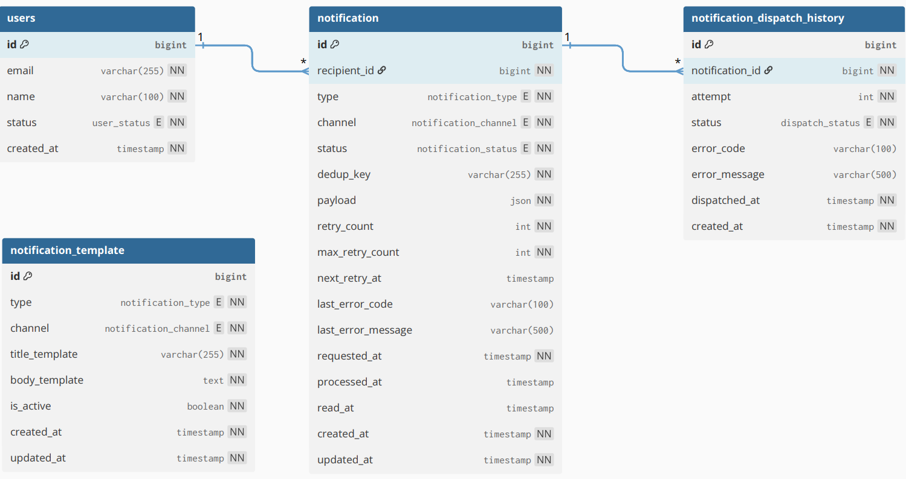
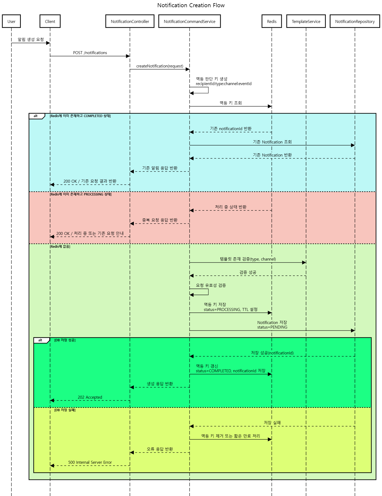
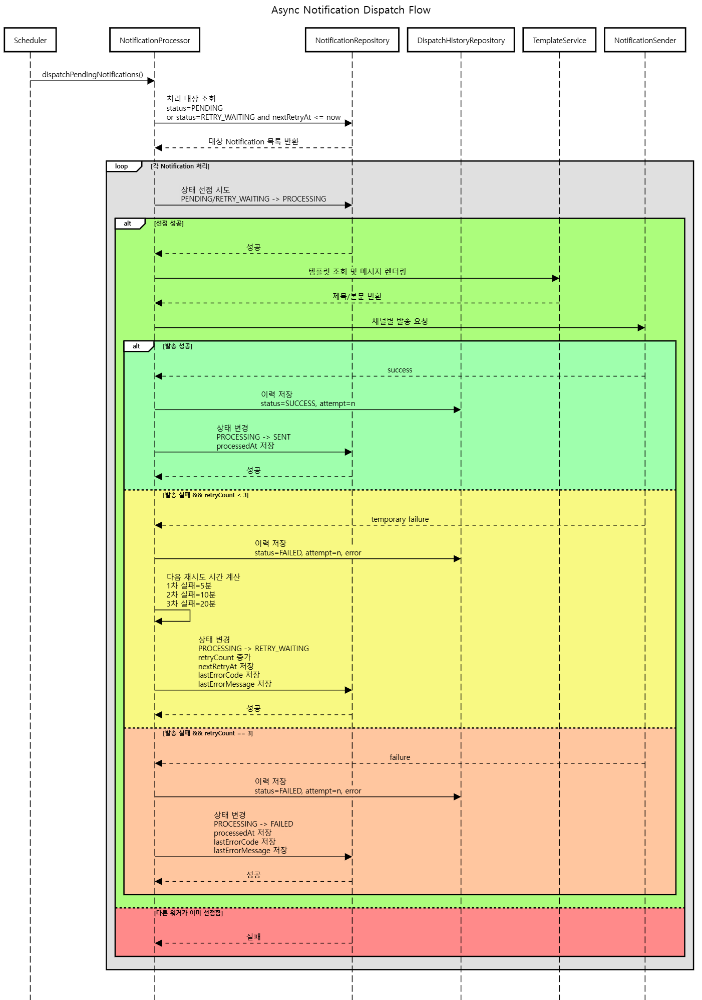

# Notification System

프로덕트 엔지니어 채용 과제 `BE-C. 알림 발송 시스템` 제출용 프로젝트다.  
다양한 도메인 이벤트에 대해 이메일과 인앱 알림을 **중복 없이 생성하고, 비동기로 처리하며, 실패 시 재시도하고, 서버 재시작 이후에도 복구 가능한 구조**로 설계하는 것을 목표로 했다.

## 프로젝트 개요

다음 이벤트를 예시로 하는 알림 시스템을 구현한다.

- 수강 신청 완료
- 결제 확정
- 강의 시작 D-1
- 취소 처리

핵심 목표는 다음과 같다.

- 알림 발송 요청을 즉시 처리하지 않고 비동기로 접수
- 동일 이벤트에 대한 중복 발송 방지
- 실패 이력 및 실패 사유 기록
- 재시도 정책 적용
- 서버 재시작 및 다중 인스턴스 환경에서도 복구 가능

## 기술 스택

- Java 17
- Spring Boot
- Spring Data JPA
- PostgreSQL
- Redis
- Docker Compose
- JUnit 5
- H2

선택 이유:

- Spring Boot: API, 스케줄러, 트랜잭션 구성을 단순하게 가져가기 좋다.
- JPA: 상태 기반 엔티티와 트랜잭션 경계 관리에 적합하다.
- PostgreSQL: unique 제약, 인덱스, 락 기반 동시성 제어에 적합하다.
- Redis: 짧은 시간 내 중복 요청 차단과 멱등 판단 상태 저장에 적합하다.

## 실행 방법

### 1. PostgreSQL / Redis 실행

```bash
docker compose up -d
```

기본 접속 정보:

- PostgreSQL
  - database: `notification`
  - username: `notification`
  - password: `notification`
  - port: `5432`
- Redis
  - host: `localhost`
  - port: `6379`
  - password: 없음

### 2. 애플리케이션 실행

```bash
./gradlew bootRun
```

Windows:

```bash
gradlew.bat bootRun
```

환경 변수:

- `SPRING_DATASOURCE_URL`
- `SPRING_DATASOURCE_USERNAME`
- `SPRING_DATASOURCE_PASSWORD`
- `SPRING_DATA_REDIS_HOST`
- `SPRING_DATA_REDIS_PORT`
- `SPRING_DATA_REDIS_PASSWORD`

## 요구사항 해석 및 가정

- 이 시스템은 "즉시 발송 API"가 아니라 "발송 요청을 안정적으로 접수하고 후속 비동기 처리하는 시스템"으로 해석했다.
- API는 발송 완료가 아니라 요청 접수만 보장한다.
- 생성 단계에서 잘못된 요청은 저장하지 않고 즉시 거절한다.
- `FAILED`는 비정상 요청이 아니라, 정상 요청이 재시도 이후에도 최종 실패한 상태를 의미한다.
- 읽음 상태는 기기별이 아니라 알림 자체 기준으로 관리한다.
- 실제 이메일 발송은 Mock 또는 로그 출력으로 대체한다.
- 실제 메시지 브로커는 사용하지 않지만, 운영 환경에서 외부 브로커로 전환 가능한 구조를 목표로 한다.

## 개선 의견

- 운영 환경에서는 현재 스케줄러 기반 polling 구조를 Kafka, RabbitMQ, SQS 같은 메시지 브로커 기반 구조로 전환하면 처리량 조절과 장애 격리가 더 쉬워진다.
- 운영자 API는 현재 과제 범위에 맞춰 엔드포인트만 분리했지만, 실제 서비스에서는 관리자 역할 기반 접근 제어와 감사 로그를 함께 적용해야 한다.
- 실패 코드가 충분히 표준화되면 provider timeout, temporary unavailable 같은 안전한 일시 장애만 자동 재오픈 대상으로 분류할 수 있다.

## 설계 결정과 이유

### 1. 비동기 처리 구조

알림 요청은 DB에 먼저 저장하고, 스케줄러 기반 워커가 후속 발송을 처리한다.  
이렇게 하면 비즈니스 요청과 발송 실패를 분리할 수 있고, 서버 재시작 이후에도 미처리 데이터를 다시 조회해 복구할 수 있다.

### 2. 상태 기반 처리

알림 상태는 아래와 같이 정의했다.

<table>
  <tr><th>상태</th><th>의미</th></tr>
  <tr><td><code>PENDING</code></td><td>생성 완료, 아직 처리되지 않음</td></tr>
  <tr><td><code>PROCESSING</code></td><td>워커가 현재 처리 중</td></tr>
  <tr><td><code>RETRY_WAITING</code></td><td>실패 후 다음 재시도 대기</td></tr>
  <tr><td><code>SENT</code></td><td>최종 발송 성공</td></tr>
  <tr><td><code>FAILED</code></td><td>재시도 한도 초과로 최종 실패</td></tr>
</table>

상태 전이:

- 생성 시 `PENDING`
- 워커 선점 성공 시 `PROCESSING`
- 발송 성공 시 `SENT`
- 재시도 가능 실패 시 `RETRY_WAITING`
- 재시도 한도 초과 시 `FAILED`

### 3. 중복 발송 방지 및 동시성 처리 전략

중복 문제는 생성 중복, 요청 중복, 처리 중복, 읽음 처리 동시성으로 나누어 처리한다.

#### 동일 이벤트에 대한 중복 생성 방지

같은 사용자, 타입, 채널, 비즈니스 이벤트에 대한 요청은 동일 알림으로 간주한다. 서버는 아래 기준으로 `dedupKey`를 생성한다.

```text
recipientId:type:channel:eventId
```

`dedupKey`는 `notification` 테이블에 저장하고 unique 제약을 둔다. 애플리케이션 레벨 검증과 별개로 DB unique 제약이 최종 중복 생성 방지의 마지막 방어선 역할을 한다.

#### 동시에 같은 요청이 여러 번 들어오는 경우

네트워크 재시도, 중복 클릭, 클라이언트 재전송처럼 짧은 시간 안에 같은 요청이 반복될 수 있다. 이를 위해 서버는 멱등 판단 키를 Redis에 TTL과 함께 저장한다.

- 동일 요청이 처음 들어오면 Redis에 멱등 판단 키를 저장하고 정상 처리한다.
- 같은 요청이 다시 들어오면 Redis를 조회해 이미 처리 중이거나 처리 완료된 요청으로 판단하고, 새로 생성하지 않는다.

Redis는 요청 수준의 빠른 중복 차단을 담당하고, DB unique(`dedupKey`)는 비즈니스 수준의 최종 중복 생성 방지를 담당한다.

#### 다중 인스턴스 환경에서의 중복 처리 방지

다중 인스턴스 환경에서는 여러 워커가 같은 알림을 동시에 조회할 수 있다. 이 문제는 단순 조회만으로 막을 수 없기 때문에, 발송 전 상태 선점 규칙을 둔다.

1. 처리 가능한 알림을 조회한다.
2. 해당 알림을 `PENDING` 또는 `RETRY_WAITING` 상태에서 `PROCESSING` 상태로 원자적으로 전이한다.
3. 이 상태 전이에 성공한 워커만 실제 발송을 수행한다.

즉, 조회한 워커가 아니라 상태 전이에 성공한 워커만 발송 권한을 가진다.

#### 읽음 처리 동시성

읽음 상태는 기기별 상태가 아니라 알림 자체의 상태로 관리한다. `notification.read_at` 필드를 기준으로 읽음 여부를 판단한다.

- `read_at == null`: 안 읽음
- `read_at != null`: 읽음

읽음 처리 요청은 멱등하게 동작한다. 이미 읽은 알림에 대해 다시 읽음 요청이 들어와도 최초 읽음 시각만 보존하고 성공으로 처리한다.

### 4. 재시도 정책

<table>
  <tr><th>단계</th><th>정책</th></tr>
  <tr><td>최초 발송</td><td>1회 시도</td></tr>
  <tr><td>1차 실패</td><td>5분 후 재시도</td></tr>
  <tr><td>2차 실패</td><td>10분 후 재시도</td></tr>
  <tr><td>3차 실패</td><td>20분 후 재시도</td></tr>
  <tr><td>최종 실패</td><td><code>FAILED</code> 전이</td></tr>
</table>

실패 시 `lastErrorCode`, `lastErrorMessage`, `retryCount`, `nextRetryAt`을 함께 기록한다.

### 5. 최종 실패 보관 및 수동 재시도 정책

자동 재시도 이후에도 발송에 실패한 알림은 `FAILED` 상태로 전이한다. 최종 실패 건은 폐기하지 않고 운영자가 조회할 수 있도록 보관한다.

운영자는 최종 실패 조회 API를 통해 알림 기본 정보, 상태, 재시도 횟수, 마지막 실패 코드와 메시지, 수신자, 타입, 채널, 최종 처리 시각을 확인할 수 있다. 발송 시도 이력은 `notification_dispatch_history` 테이블에 별도로 저장한다.

#### 자동 재시도와 수동 재시도의 역할 분리

자동 재시도는 일시적인 장애를 복구하기 위한 기본 장치다. 5분, 10분, 20분 간격으로 재시도한 뒤에도 실패하면 `FAILED`가 된다.

`FAILED` 상태에 도달한 알림은 자동 재처리하지 않는다. 잘못된 데이터나 정책상 재발송이 부적절한 상황일 수 있기 때문에, 최종 실패 이후의 재처리는 운영자 판단 기반의 수동 재시도를 기본 정책으로 둔다.

#### 수동 재시도 가능한 경우

외부 이메일 제공자 장애 해소, 네트워크 타임아웃, 템플릿 수정처럼 재발송 가능 상태가 된 경우 운영자는 `FAILED` 알림을 다시 재처리 대기열에 올릴 수 있다.

현재 구현은 `FAILED -> RETRY_WAITING`, `retryCount = 0`, `nextRetryAt = now`로 상태를 변경한다. 수동 재시도는 즉시 발송이 아니라 스케줄러가 다시 처리할 수 있는 상태로 되돌리는 행위다.

#### 수동 재시도 시 중복 처리 방지

수동 재시도 역시 상태 전이 규칙 안에서 통제한다. 현재 구현은 `FAILED` 상태의 알림만 수동 재시도 대상으로 허용하며, 이미 `RETRY_WAITING`, `PROCESSING`, `SENT` 상태인 알림에는 수동 재시도를 허용하지 않는다.

운영자 재시도 요청 이력의 별도 저장과 여러 건 일괄 재시도는 확장 포인트로 남겨두었다.

#### 운영 보조 자동화 방향

최종 실패 전체를 자동 재처리하는 것은 위험할 수 있으므로 기본 정책은 수동 재시도다. 다만 운영 편의를 위해 다음 기능은 확장할 수 있다.

- 실패 코드 기준으로 재시도 가능성이 높은 건 필터링
- 특정 시간대에 특정 오류 코드로 실패한 건 일괄 조회
- 운영자가 선택한 실패 건을 일괄 `RETRY_WAITING`으로 전환

특정 실패 코드에 대한 자동 재오픈도 확장할 수 있다. 예를 들어 provider timeout, temporary unavailable, transient network error처럼 외부 장애 해소 후 재처리가 안전한 코드만 `FAILED -> RETRY_WAITING`으로 자동 전환할 수 있다.

### 6. 운영 시나리오 대응

- 서버 재시작 후 `PENDING`, `RETRY_WAITING` 상태를 다시 조회해 재처리한다.
- `PROCESSING` 상태가 10분 이상 유지되면 stale 데이터로 판단한다. 스케줄러가 이를 실패 시도로 이력에 저장하고, 재시도 한도가 남아 있으면 `RETRY_WAITING`으로 복구한다.
- 발송 시도 결과는 별도 이력 테이블에 저장해 운영 추적성을 확보한다.

### 7. 템플릿 관리

선택 구현 항목으로 `notification_template` 테이블을 두고, 생성 단계에서 타입/채널별 템플릿 존재 여부를 검증하도록 설계했다.

## API 목록 및 예시

### 1. 알림 발송 요청 등록

`POST /api/notifications`

요청 예시:

```json
{
  "recipientId": 101,
  "type": "PAYMENT_CONFIRMED",
  "channel": "EMAIL",
  "payload": {
    "eventId": "payment-5001",
    "courseId": 301,
    "paymentId": 5001
  }
}
```

응답 예시:

```json
{
  "notificationId": 1,
  "status": "PENDING",
  "requestedAt": "2026-04-24T10:00:00"
}
```

성공 응답 코드는 `202 Accepted`다. API는 실제 발송 완료가 아니라 발송 요청 접수를 의미한다.

### 2. 알림 상태 조회

`GET /api/notifications/{notificationId}`

응답 예시:

```json
{
  "notificationId": 1,
  "recipientId": 101,
  "type": "PAYMENT_CONFIRMED",
  "channel": "EMAIL",
  "status": "RETRY_WAITING",
  "retryCount": 1,
  "nextRetryAt": "2026-04-24T10:05:00",
  "lastErrorCode": "EMAIL_TEMPORARY_FAILURE",
  "lastErrorMessage": "mock smtp timeout"
}
```

### 3. 사용자 알림 목록 조회

`GET /api/users/{recipientId}/notifications?read=false`

### 4. 읽음 처리

`PATCH /api/notifications/{notificationId}/read`

### 5. 운영자 최종 실패 알림 조회

`GET /api/admin/notifications/failed?size=50`

재시도 한도를 모두 사용해 `FAILED`가 된 알림만 조회한다. 운영자는 이 응답의 `lastErrorCode`, `lastErrorMessage`, `processedAt`을 보고 수동 재처리 여부를 판단한다.

응답 예시:

```json
[
  {
    "notificationId": 1,
    "recipientId": 101,
    "type": "PAYMENT_CONFIRMED",
    "channel": "EMAIL",
    "status": "FAILED",
    "retryCount": 4,
    "maxRetryCount": 3,
    "lastErrorCode": "EMAIL_TEMPORARY_FAILURE",
    "lastErrorMessage": "mock smtp timeout",
    "processedAt": "2026-04-24T10:35:00"
  }
]
```

### 6. 운영자 수동 재시도 전환

`PATCH /api/admin/notifications/{notificationId}/manual-retry`

최종 실패 알림을 `RETRY_WAITING`으로 되돌리고 `retryCount`를 `0`으로 초기화한다. `nextRetryAt`은 현재 시각으로 설정되므로 다음 스케줄러 실행 때 다시 발송 대상이 된다.

응답 예시:

```json
{
  "notificationId": 1,
  "recipientId": 101,
  "type": "PAYMENT_CONFIRMED",
  "channel": "EMAIL",
  "status": "RETRY_WAITING",
  "retryCount": 0,
  "nextRetryAt": "2026-04-24T10:40:00",
  "lastErrorCode": "EMAIL_TEMPORARY_FAILURE",
  "lastErrorMessage": "mock smtp timeout"
}
```

이미 `RETRY_WAITING`, `PROCESSING`, `SENT` 상태인 알림에는 수동 재시도를 허용하지 않는다. 수동 재시도는 최종 실패한 `FAILED` 알림을 다시 스케줄러 처리 대상으로 올리는 운영자 조치다.

## 데이터 모델 설명

ERD:

<p align="center">
  
</p>

핵심 테이블:

- `users`
  - 알림 수신자 기준 데이터
- `notification`
  - 알림 요청 본체
  - 상태, 재시도, 실패 정보, 읽음 상태 관리
- `notification_dispatch_history`
  - 발송 시도 이력 관리
- `notification_template`
  - 타입/채널별 메시지 템플릿 관리

주요 제약:

- `notification.dedup_key` unique
- `notification(status, next_retry_at)` 인덱스
- `notification(recipient_id, created_at desc)` 인덱스
- `notification_dispatch_history(notification_id, attempt)` unique
- `notification_template(type, channel)` unique

테이블 명세:

### `users`

<table>
  <tr><th>컬럼</th><th>타입</th><th>제약</th><th>설명</th></tr>
  <tr><td><code>id</code></td><td><code>bigint</code></td><td>PK</td><td>사용자 ID</td></tr>
  <tr><td><code>email</code></td><td><code>varchar(255)</code></td><td>NOT NULL, UNIQUE</td><td>이메일 주소</td></tr>
  <tr><td><code>name</code></td><td><code>varchar(100)</code></td><td>NOT NULL</td><td>사용자 이름</td></tr>
  <tr><td><code>status</code></td><td><code>user_status</code></td><td>NOT NULL</td><td>사용자 상태</td></tr>
  <tr><td><code>created_at</code></td><td><code>timestamp</code></td><td>NOT NULL</td><td>생성 시각</td></tr>
</table>

### `notification`

<table>
  <tr><th>컬럼</th><th>타입</th><th>제약</th><th>설명</th></tr>
  <tr><td><code>id</code></td><td><code>bigint</code></td><td>PK</td><td>알림 ID</td></tr>
  <tr><td><code>recipient_id</code></td><td><code>bigint</code></td><td>NOT NULL, FK</td><td>수신자 ID</td></tr>
  <tr><td><code>type</code></td><td><code>notification_type</code></td><td>NOT NULL</td><td>알림 타입</td></tr>
  <tr><td><code>channel</code></td><td><code>notification_channel</code></td><td>NOT NULL</td><td>발송 채널</td></tr>
  <tr><td><code>status</code></td><td><code>notification_status</code></td><td>NOT NULL</td><td>처리 상태</td></tr>
  <tr><td><code>dedup_key</code></td><td><code>varchar(255)</code></td><td>NOT NULL, UNIQUE</td><td>비즈니스 중복 방지 키</td></tr>
  <tr><td><code>payload</code></td><td><code>json</code></td><td>NOT NULL</td><td>참조 데이터</td></tr>
  <tr><td><code>retry_count</code></td><td><code>int</code></td><td>NOT NULL</td><td>현재 재시도 횟수</td></tr>
  <tr><td><code>max_retry_count</code></td><td><code>int</code></td><td>NOT NULL</td><td>최대 재시도 횟수</td></tr>
  <tr><td><code>next_retry_at</code></td><td><code>timestamp</code></td><td>NULL</td><td>다음 재시도 시각</td></tr>
  <tr><td><code>last_error_code</code></td><td><code>varchar(100)</code></td><td>NULL</td><td>마지막 실패 코드</td></tr>
  <tr><td><code>last_error_message</code></td><td><code>varchar(500)</code></td><td>NULL</td><td>마지막 실패 사유</td></tr>
  <tr><td><code>requested_at</code></td><td><code>timestamp</code></td><td>NOT NULL</td><td>요청 접수 시각</td></tr>
  <tr><td><code>processed_at</code></td><td><code>timestamp</code></td><td>NULL</td><td>최종 처리 시각</td></tr>
  <tr><td><code>read_at</code></td><td><code>timestamp</code></td><td>NULL</td><td>읽음 처리 시각</td></tr>
  <tr><td><code>created_at</code></td><td><code>timestamp</code></td><td>NOT NULL</td><td>생성 시각</td></tr>
  <tr><td><code>updated_at</code></td><td><code>timestamp</code></td><td>NOT NULL</td><td>수정 시각</td></tr>
</table>

### `notification_dispatch_history`

<table>
  <tr><th>컬럼</th><th>타입</th><th>제약</th><th>설명</th></tr>
  <tr><td><code>id</code></td><td><code>bigint</code></td><td>PK</td><td>이력 ID</td></tr>
  <tr><td><code>notification_id</code></td><td><code>bigint</code></td><td>NOT NULL, FK</td><td>알림 ID</td></tr>
  <tr><td><code>attempt</code></td><td><code>int</code></td><td>NOT NULL</td><td>발송 시도 순번</td></tr>
  <tr><td><code>status</code></td><td><code>dispatch_status</code></td><td>NOT NULL</td><td>발송 결과</td></tr>
  <tr><td><code>error_code</code></td><td><code>varchar(100)</code></td><td>NULL</td><td>실패 코드</td></tr>
  <tr><td><code>error_message</code></td><td><code>varchar(500)</code></td><td>NULL</td><td>실패 메시지</td></tr>
  <tr><td><code>dispatched_at</code></td><td><code>timestamp</code></td><td>NOT NULL</td><td>발송 시각</td></tr>
  <tr><td><code>created_at</code></td><td><code>timestamp</code></td><td>NOT NULL</td><td>생성 시각</td></tr>
</table>

### `notification_template`

<table>
  <tr><th>컬럼</th><th>타입</th><th>제약</th><th>설명</th></tr>
  <tr><td><code>id</code></td><td><code>bigint</code></td><td>PK</td><td>템플릿 ID</td></tr>
  <tr><td><code>type</code></td><td><code>notification_type</code></td><td>NOT NULL</td><td>알림 타입</td></tr>
  <tr><td><code>channel</code></td><td><code>notification_channel</code></td><td>NOT NULL</td><td>발송 채널</td></tr>
  <tr><td><code>title_template</code></td><td><code>varchar(255)</code></td><td>NOT NULL</td><td>제목 템플릿</td></tr>
  <tr><td><code>body_template</code></td><td><code>text</code></td><td>NOT NULL</td><td>본문 템플릿</td></tr>
  <tr><td><code>is_active</code></td><td><code>boolean</code></td><td>NOT NULL</td><td>활성 여부</td></tr>
  <tr><td><code>created_at</code></td><td><code>timestamp</code></td><td>NOT NULL</td><td>생성 시각</td></tr>
  <tr><td><code>updated_at</code></td><td><code>timestamp</code></td><td>NOT NULL</td><td>수정 시각</td></tr>
</table>

## 비동기 처리 구조 및 재시도 정책

알림 생성 흐름:

1. API가 알림 생성 요청을 수신한다.
2. 요청 데이터로 멱등 판단 키와 `dedupKey`를 생성한다.
3. Redis에서 동일 요청 여부를 확인한다.
4. 템플릿과 요청 유효성을 검증한다.
5. Redis에 처리 중 상태를 저장한다.
6. `notification`을 `PENDING` 상태로 저장한다.
7. 저장 성공 시 Redis 상태를 완료로 갱신한다.

발송 흐름:

1. 스케줄러가 `PENDING`, `RETRY_WAITING` 대상을 조회한다.
2. 10분 이상 `PROCESSING`에 머문 stale 대상을 실패 이력으로 저장하고 재시도 상태로 복구한다.
3. 워커가 상태 선점에 성공한 경우에만 `PROCESSING`으로 전이한다.
4. 템플릿 조회 후 채널별 sender로 발송한다.
5. 성공 시 `SENT`, 실패 시 `RETRY_WAITING` 또는 `FAILED`로 전이한다.
6. 각 시도 결과는 `notification_dispatch_history`에 저장한다.

시퀀스 다이어그램:

<p align="center">
  
</p>

<p align="center">
  
</p>

## 테스트 실행 방법

```bash
./gradlew test
```

Windows:

```bash
gradlew.bat test
```

## 미구현 / 제약사항

- 실제 이메일 서버 연동은 구현하지 않고 Mock 또는 로그 출력으로 대체한다.
- 실제 메시지 브로커는 사용하지 않는다.
- 운영자 API는 별도 엔드포인트로 분리했지만, 사용자 역할 기반 권한 모델은 구현하지 않았다.
- 예약 발송, 고도화된 읽음 충돌 정책은 확장 포인트로 남겨두었다.
- 특정 실패 코드에 대한 자동 재오픈은 확장 포인트로 남겨두었다. 예를 들어 provider timeout, temporary unavailable, transient network error처럼 외부 장애 해소 후 재처리가 안전한 코드만 `FAILED -> RETRY_WAITING`으로 자동 전환할 수 있다. 영구 실패나 요청 데이터 오류는 자동 재오픈 대상에서 제외해야 한다.

## AI 활용 범위

- 요구사항 해석 초안 정리
- README 구조화 및 문장 다듬기
- 설계 설명 초안 보조

최종 설계 판단과 문서 내용은 직접 검토하고 수정했다.
